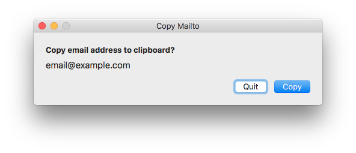

Copy Mailto
===========

A `mailto:` link handler that allows you to copy the email address to the
clipboard.

## Usage
Once the application has been registered as the default app for `mailto:` links,
it will open whenever one is clicked.

The following keyboard shortcuts are available in the app:

| Shortcut            | Action                      |
|---------------------|-----------------------------|
| **q** or **Escape** | Quit                        |
|      **Enter**      | Copy email address and quit |

To set Copy Mailto as the default handler for `mailto:` URLs, run:

	$ /Applications/Copy\ Mailto.app/Contents/MacOS/Copy\ Mailto --set-url-handler

## Install
Download the app from the [releases][1] page. Unzip it and drag it to the
`Applications` folder.

Copy Mailto is designed to work on Mac OS X 10.6 and later.

## License
Copyright © 2018 Teddy Wing. Licensed under the GNU GPLv3+ (see the included
COPYING file).

[1]: https://github.com/teddywing/Copy-Mailto/releases
